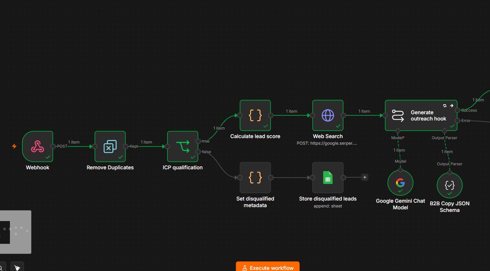
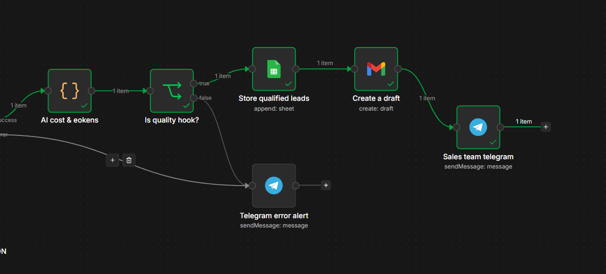
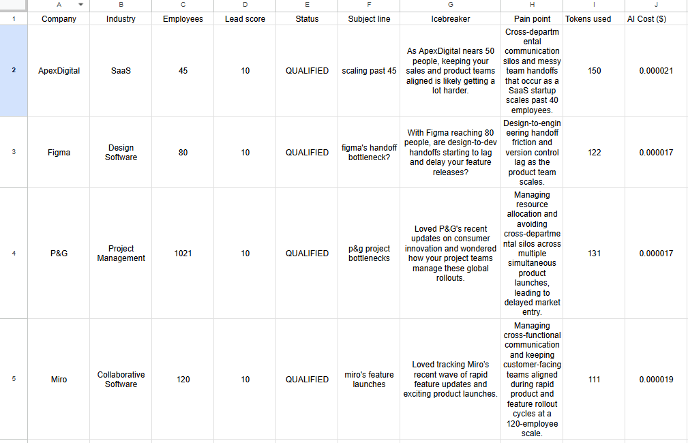
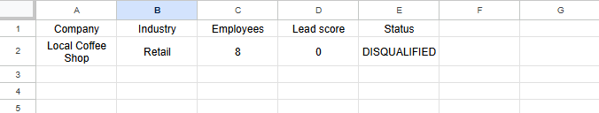
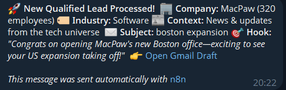
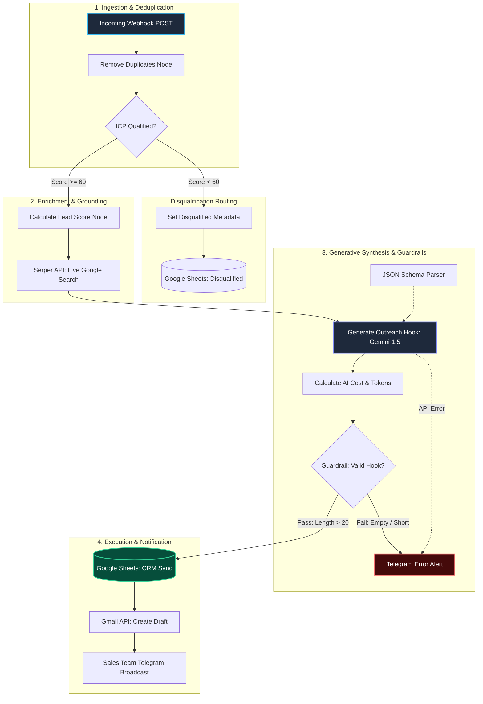

# Lead-enrichment-and-AI-cost-engine
Production-grade n8n automation pipeline for real-time B2B lead enrichment, LLM personalization, dynamic token cost tracking, and CRM sync.

<div align="center">

# ⚡ AURA

### Autonomous B2B Outreach Intelligence & Unit-Economic Cost Engine

*Real-time ICP qualification, live search grounding via Serper API, structured Gemini 1.5 JSON synthesis, and sub-cent unit-economic cost tracking.*

[](https://n8n.io)
[](https://deepmind.google/technologies/gemini/)
[](https://serper.dev)
[](https://sheets.google.com)
[](LICENSE)

</div>

---

## 📄 Overview

Traditional B2B outbound workflows either rely on static templates with low reply rates or blind LLM batch generation that exhausts API rate limits and hallucinates facts. **AURA** addresses this by serving as an event-driven outbound personalization infrastructure with built-in cost tracking.

Incoming webhook events trigger a multi-stage validation, web enrichment, and AI reasoning loop. Every prospect is deduplicated against real-time operational windows, scored against rule-based ICP thresholds, grounded via live Google Search results, and synthesized into custom cold outreach hooks via **Gemini 1.5 Flash** with strict JSON schemas.

1. **Evaluates ICP Fit** — Filters out non-target companies based on headcount, industry criteria, and data completeness.
2. **Executes Live Web Grounding** — Pulls live search snippets (news, announcements, press releases) via Serper API to prevent LLM hallucinations.
3. **Structured Synthesis** — Forces Gemini 1.5 Flash through strict Output Parsers into a validated JSON schema (`subject_line`, `icebreaker`, `pain_point`).
4. **Calculates Real-Time Unit Economics** — Measures prompt/completion tokens and logs exact infrastructure costs (sub-$0.0002/lead).
5. **Human-in-the-Loop Delivery** — Creates staged drafts in Gmail and broadcasts instant rich Telegram alerts with CRM direct links.

---

## 📸 Visual Showcase

| Lead Ingestion & Web Enrichment Engine | Guardrails, Unit Economics & Execution |
| :---: | :---: |
|  |  |
| *Webhook Ingestion, Temporal Deduplication, Serper Search & Gemini 1.5 Synthesis* | *Token Cost Calculation, Quality Validation Guardrail & Gmail Draft Automation* |

| Live Qualified CRM with Dynamic Unit-Economics | ICP Disqualification Quarantine Ledger |
| :---: | :---: |
|  |  |
| *Structured CRM Sync: Real-Time Token Tracking & Sub-Cent Infrastructure Cost ($/Lead)* | *Zero-Waste Retention: Automatic ICP Disqualification Routing for Cold Retargeting* |

<div align="center">

### Real-Time SDR Notification Delivery



*Rich Telegram Alert with Company Meta, Live Context Hook & Direct Deep Link to Staged Gmail Draft*

</div>

---

## 🏗 System & Pipeline Architecture



---

## ⚡ 10-Step Pipeline Execution Flow

```text
Step 0   WEBHOOK_INGEST      — Receives structured POST payload from forms, CRM, or lead lists
Step 1   DEDUP_FILTER        — In-memory hash deduplication against (company + contact_email)
Step 2   ICP_EVALUATOR       — Rule-based heuristics evaluating headcount, industry target, and domain validity
Step 2b  DISQ_RECORD         — Sub-threshold leads diverted to Google Sheets 'Disqualified' sheet for retargeting
Step 3   SERPER_SEARCH       — Live SERP search query constructed dynamically: "<Company> business announcement expansion news"
Step 4   SNIPPET_EXTRACTION  — Top organic snippets parsed and sanitized into a contextual string
Step 5   LLM_INFERENCE       — Gemini 1.5 Flash synthesizes custom email components via system prompt
Step 6   SCHEMA_VALIDATION   — Structured JSON Output Parser validates icebreaker, pain point, and subject line
Step 7   COST_ACCOUNTING     — Mathematical calculation of input/output token cost via Gemini pricing formulas
Step 8   STRING_GUARDRAIL    — Null check & string length verification (> 20 chars) to prevent empty drafts
Step 9   CRM_PERSISTENCE     — Qualified row appended to Google Sheets CRM with score, tokens, and USD cost
Step 10  DISPATCH_EXECUTION  — Draft created in Gmail inbox; rich Markdown card dispatched to Telegram SDR bot
```
